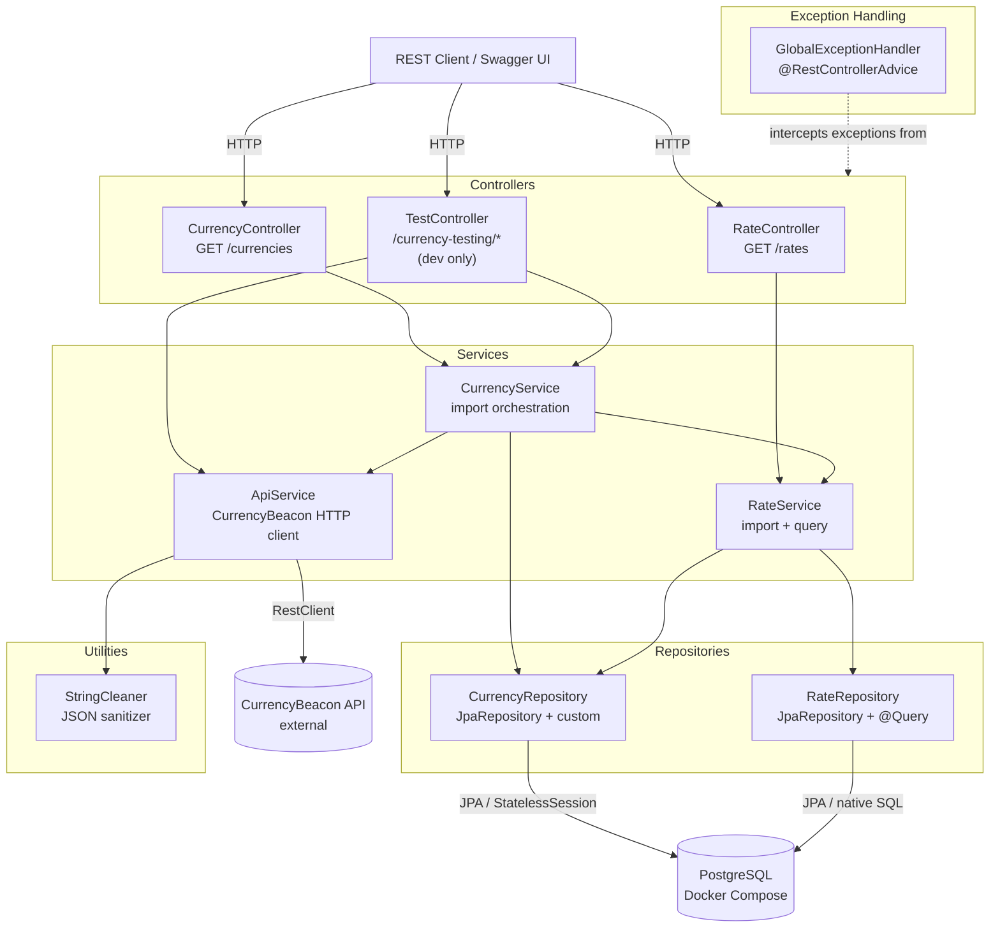

# Application Architecture

> Generated by [Claude Code](https://claude.ai/code)

**Key design decisions:**
- `CurrencyService` and `RateService` are separate beans — `createRate()` is `@Transactional` and must be called through Spring's proxy, not via `this` inside `CurrencyService`.
- `getAllCurrencyCodes()` is a `default` method on `CurrencyRepository` — avoids circular injection between `CurrencyService` and `RateService`.
- `RateService.createRate()` uses Hibernate `StatelessSession` directly (bypassing JPA), reducing full import time from ~22 minutes to ~3m40s.
