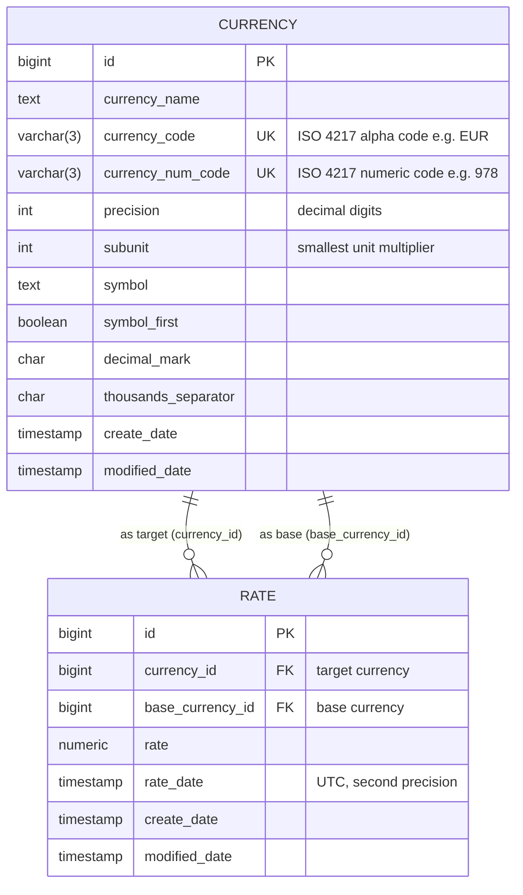

# Data Model

> Generated by [Claude Code](https://claude.ai/code)

**Notes:**
- `RATE` has a composite unique constraint on `(currency_id, base_currency_id, rate_date)` — prevents duplicate imports.
- Both foreign keys on `RATE` point at the same `CURRENCY` table (self-referencing via two distinct FK columns).
- `rate_date` is stored in UTC. Local-date queries use `AT TIME ZONE` in SQL to handle the Estonia 21:00–00:00 UTC window correctly.
- Base-currency-against-itself rates (e.g. EUR/EUR = 1.0) are not stored — returned in-memory by the query endpoint.
