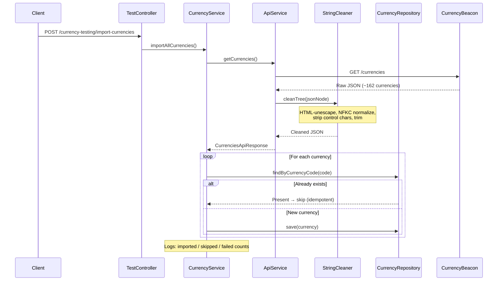
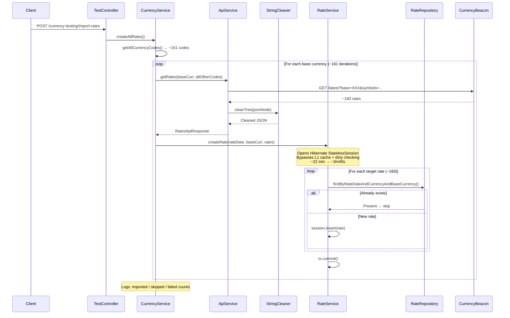

# Data Import Flow

> Generated by [Claude Code](https://claude.ai/code)

## Currency import

```mermaid
sequenceDiagram
    participant Client
    participant TestController
    participant CurrencyService
    participant ApiService
    participant StringCleaner
    participant CurrencyRepository
    participant CurrencyBeacon

    Client->>TestController: POST /currency-testing/import-currencies
    TestController->>CurrencyService: importAllCurrencies()
    CurrencyService->>ApiService: getCurrencies()
    ApiService->>CurrencyBeacon: GET /currencies
    CurrencyBeacon-->>ApiService: Raw JSON (~162 currencies)
    ApiService->>StringCleaner: cleanTree(jsonNode)
    Note over StringCleaner: HTML-unescape, NFKC normalize,<br/>strip control chars, trim
    StringCleaner-->>ApiService: Cleaned JSON
    ApiService-->>CurrencyService: CurrenciesApiResponse

    loop For each currency
        CurrencyService->>CurrencyRepository: findByCurrencyCode(code)
        alt Already exists
            CurrencyRepository-->>CurrencyService: Present → skip (idempotent)
        else New currency
            CurrencyService->>CurrencyRepository: save(currency)
        end
    end
    Note over CurrencyService: Logs: imported / skipped / failed counts
```

## Rates import

```mermaid
sequenceDiagram
    participant Client
    participant TestController
    participant CurrencyService
    participant ApiService
    participant StringCleaner
    participant RateService
    participant RateRepository
    participant CurrencyBeacon

    Client->>TestController: POST /currency-testing/import-rates
    TestController->>CurrencyService: createAllRates()
    CurrencyService->>CurrencyService: getAllCurrencyCodes() → ~161 codes

    loop For each base currency (~161 iterations)
        CurrencyService->>ApiService: getRates(baseCurr, allOtherCodes)
        ApiService->>CurrencyBeacon: GET /latest?base=XXX&symbols=...
        CurrencyBeacon-->>ApiService: ~160 rates
        ApiService->>StringCleaner: cleanTree(jsonNode)
        StringCleaner-->>ApiService: Cleaned JSON
        ApiService-->>CurrencyService: RatesApiResponse
        CurrencyService->>RateService: createRate(rateDate, baseCurr, rates)

        Note over RateService: Opens Hibernate StatelessSession<br/>Bypasses L1 cache + dirty checking<br/>~22 min → ~3m40s

        loop For each target rate (~160)
            RateService->>RateRepository: findByRateDateAndCurrencyAndBaseCurrency()
            alt Already exists
                RateRepository-->>RateService: Present → skip
            else New rate
                RateService->>RateService: session.insert(rate)
            end
        end
        RateService->>RateService: tx.commit()
    end
    Note over CurrencyService: Logs: imported / skipped / failed counts
```
