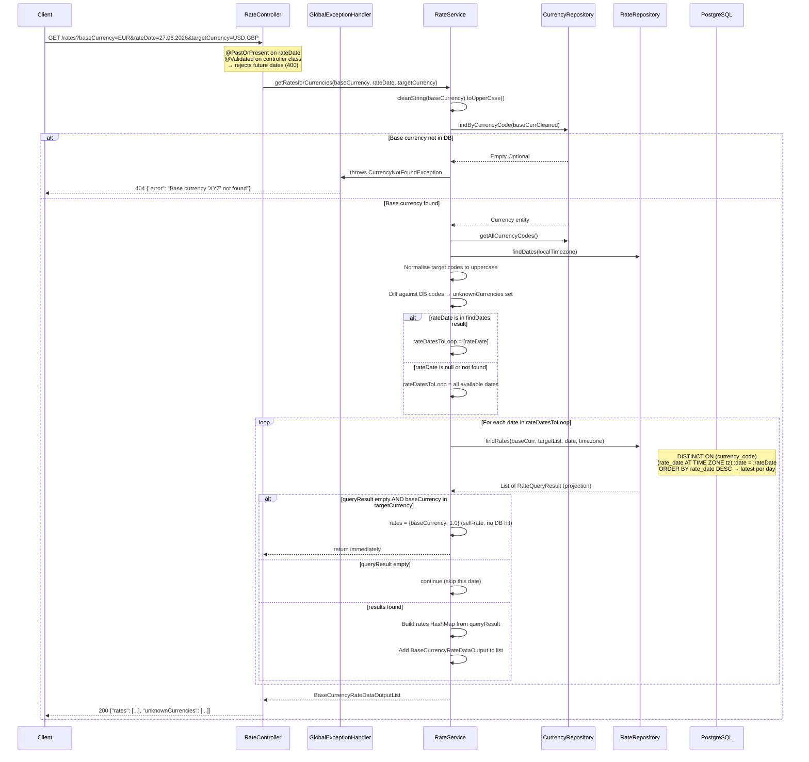

# Rate Query Flow

> Generated by [Claude Code](https://claude.ai/code)

## GET /rates request flow

## Error responses summary

| Scenario | HTTP Status | Response |
|---|---|---|
| Invalid base currency | 404 | `{"error": "Base currency 'XYZ' not found"}` |
| Future date supplied | 400 | `{"error": "must be a date in the past or in the present"}` |
| Unknown target currencies | 200 | Valid rates + `"unknownCurrencies": ["XYZ"]` |
| No data for requested date | 200 | `{"rates": [], "unknownCurrencies": [...]}` |
| Self-rate (EUR/EUR) | 200 | `{"rates": [{"rates": {"EUR": 1.00}}]}` |
| Unexpected server error | 500 | `{"error": "Unexpected error: ..."}` |
